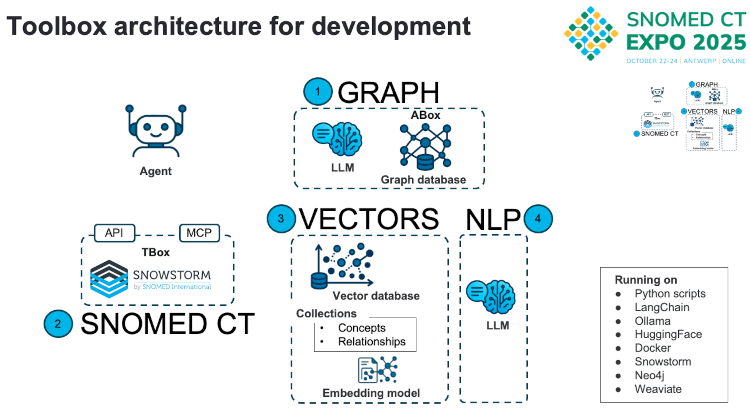

# 202566 SNOMED CT: Bridging language differences between training and querying AI models for healthcare
Authors: Ulrich Andersen (DK) & Karol Hårsaker (NO) 

Presented at [SNOMED CT Expo 2025](https://www.snomed.org/snomedct-expo); see the [annoucement (LinkedIn)](https://www.linkedin.com/posts/karol-haarsaker_glad-to-announce-that-ulrich-and-me-are-soon-activity-7383744474075533312-U9TE?utm_source=share&utm_medium=member_desktop&rcm=ACoAABO8_pwBxrQpts7ouQOxl1sjKiyspCKYTac).

Inspired by the work from ***CogStack***, e.g. [Foresight-generative pre-trained transformer](https://youtu.be/O3LU2ZX0ziM?si=ldROGokUhMiF_vjk)  

We are dedicated to make semantic interoperability a practical reality, experimenting with the newest technologies.  
  
You can find below some headlines about our work. **More resources coming up** (updating, also on-demand)...  

**Stay tuned !**  

## Contact information
If any comment, suggestion or questions, please do not hesitate to take contact and discuss the subject.  

This page on GitHub: [https://github.com/karoltech/bridging](https://github.com/karoltech/bridging)  

Ulrich L. S. Andersen, MD, MPA  
[uan@sorano.net](mailto:uan@sorano.net)  

Karol Hårsaker, MSc  
[kh@styrmand.no](mailto:kh@styrmand.no)   
[https://www.linkedin.com/in/karol-haarsaker](https://www.linkedin.com/in/karol-haarsaker)  
[karol@kovatech.no](mailto:karol@kovatech.no)  

## Description 

Bridging language differences between training and querying AI models for healthcare, 

SNOMED CT Expo 2025, track "Advances in Research & Innovation", Thursday October 23, 11:30-12:30; see the program on [SNOMED CT Expo](https://lnkd.in/dszmKMFu). 

### Abstract

The healthcare landscape is increasingly witnessing the transformative potential of generative artificial intelligence (AI) across various applications, including the automation of clinical documentation and the enhancement of patient communication. Recent advances in large language model (LLM) architectures and transformer based sequence forecasting have opened new perspectives for longitudinal clinical decision support (CDS). However, a significant impediment to achieving equitable and effective healthcare delivery, particularly within the realm of AI applications, lies in the inherent linguistic diversity of global populations. This diversity encompasses not only the multitude of languages spoken worldwide but also the variations within those languages, including dialects and culturally specific expressions (i.e. practice). Generative AI models, often trained predominantly on English language data, frequently encounter difficulties in accurately processing and understanding different languages and their nuances. This limitation can lead to inaccurate translations, misinterpretations of critical medical information, and ultimately, the exacerbation of existing health disparities among different linguistic communities. This presentation aims to explore the features and capabilities of SNOMED CT in the context of using LLMs and elucidate how they can effectively address the challenges posed by linguistic diversity in the application of generative AI within clinical practice, ultimately fostering more inclusive and accurate healthcare solutions. The presentation will demonstrate how the Foresight Timeline generation tool using synthetic patient data based on various instances of the SNOMED Basic Synthetic Patient Data Generator (BSPG) performs with various AI models and languages (editions of SNOMED CT).

## Infrastucture 
Here is an overview of the infrastructure we are presently using, connecting the components together.  

  

- Generating synthetic data with [Snolytical - SNOMED CT Data Analytics Demonstrator](https://github.com/IHTSDO/health-data-analytics)  
- Uploading timelines in [Foresight](https://foresight.sites.er.kcl.ac.uk/)  
- [CogStack Product Documentation](https://cogstack.atlassian.net/wiki/spaces/COGDOC/pages/2406875137/CogStack+Product+Documentation)  
- [MedCAT](https://github.com/CogStack/MedCAT)  
- [SNOMED CT with MedCAT](https://htmlpreview.github.io/?https://github.com/CogStack/MedCATtutorials/blob/main/notebooks/specialised/Preprocessing_SNOMED_CT.html)  
- Building LLM applications: [LangChain](https://docs.langchain.com/oss/python/langchain/overview)  
- Run LLMs Locally: [Ollama](https://ollama.com/)  
- AI Models and deployment: [Hugging Face](https://huggingface.co/)  
- Deploying applications: [Docker](https://docs.docker.com/)  
- Terminology server: [Snowstorm]()  
- Graph database: [Neo4j](https://neo4j.com/docs/getting-started/data-modeling/tutorial-data-modeling/)  
- Vector database: [Weaviate](https://docs.weaviate.io/weaviate)  
- Agent orchestration: [LangGraph](https://langchain-ai.github.io/langgraph/guides/)  
- Connecting AI assistants: [Model Context Protocol (MCP)](https://www.anthropic.com/news/model-context-protocol)  

## References

- [SNOMED CT & AI Symposium: Building Foundations 2023 - Panel discussion](https://youtu.be/tYY5qBDP2o8?list=PLyEMmgWz-ul0drEs48nHaklNq2U8ZqtLP&t=2771)  
- [NL2ECL: Transforming Natural Language Queries to SNOMED CT Expression Constraint Language - Michael Lawley (AU) (202425)](https://www.youtube.com/watch?v=UXgow0VYSp8)  
- [Adapting Clinical Ontologies in Real-World Environments](https://pubmed.ncbi.nlm.nih.gov/20390048/)  
- [RelCAT: Advancing Extraction of Clinical Inter-Entity Relationships from Unstructured Electronic Health Records (arxiv)](https://arxiv.org/abs/2501.16077)  

## QR code (this document)

This page on GitHub: https://github.com/karoltech/bridging  
  
  
